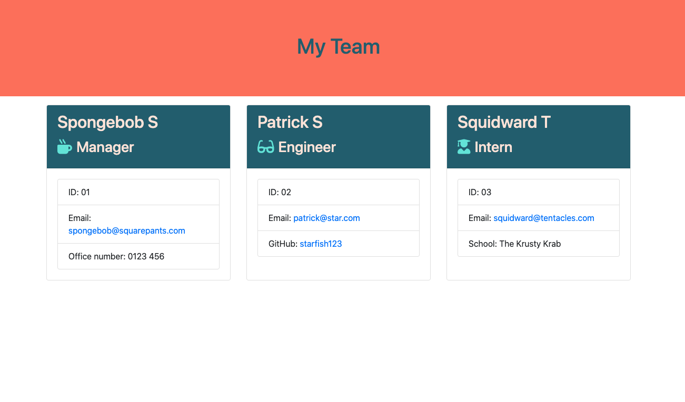

# Employee-Profile-Generator


## Description

A CLI app which generates a user friendly html file containing employee information from the inputs entered by the user.

## Table of Contents

* [Installation](#installation)
* [Usage](#usage)
* [License](#license)
* [Tests](#tests)
* [Questions](#questions)

## Installation

To install the necessary dependencies, run the following command:

```
npm i
```

## Usage

Run the following code in the Terminal or Git Bash:
```
node app.js
```
Then answer the questions to generate the employee profile with the entered content. Click [this link](https://drive.google.com/file/d/11AesTN47DtM9liZeSspdBHQ3Hdh6NAJk/view) to watch a video to see how it works.



## License

This project is licensed under the MIT license.

## Tests

To run tests, run the following command:
```
npm run test
```

## Questions

If you have any questions about the repo, open an issue or want to discuss, contact me directly at anna.s.chong@gmail.com. You can find more of my work at [acho9138](https://github.com/acho9138/.).

## Credits

Thank you to the following resources to help make this app possible:

- The Coding Bootcamp at University of Sydney
- MDN
- Stack Overflow
- Node.js
- Bootstrap
- NPM (Inquirer and Jest)